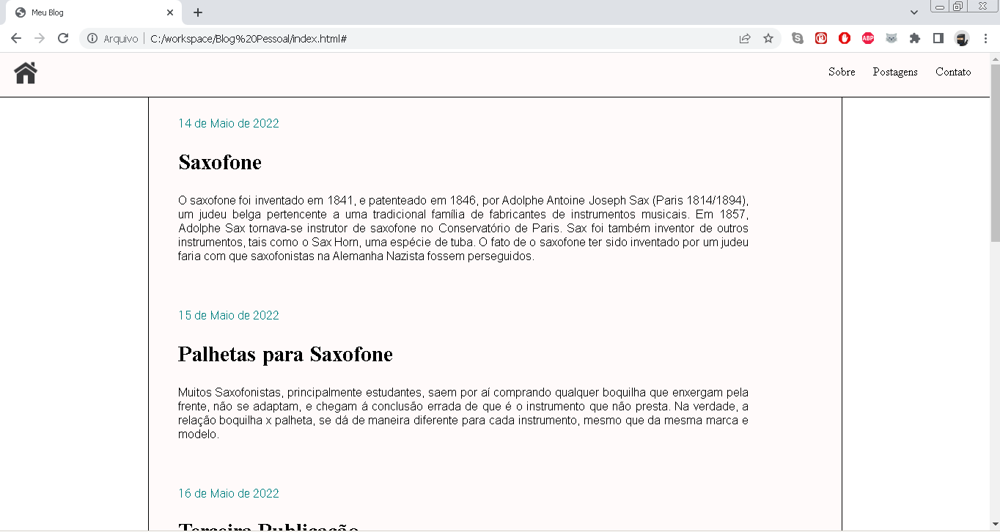
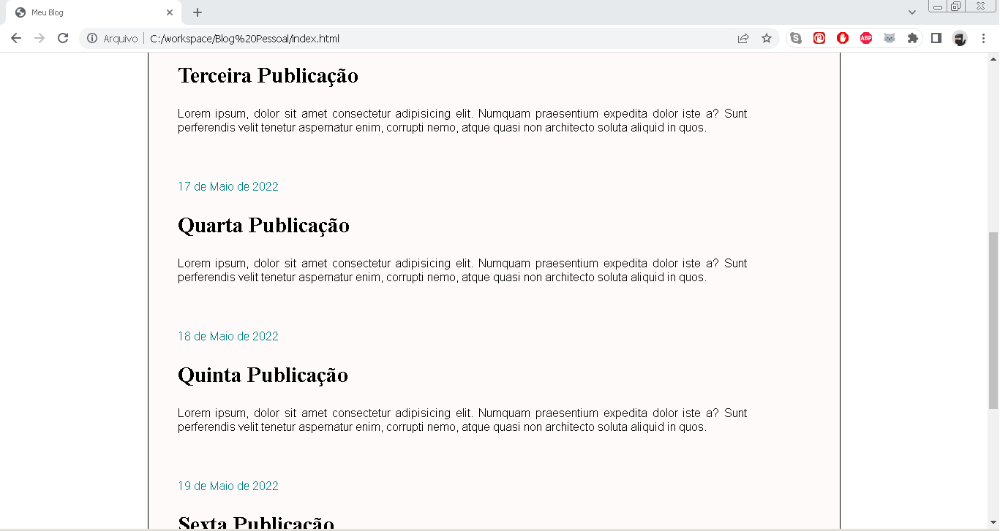
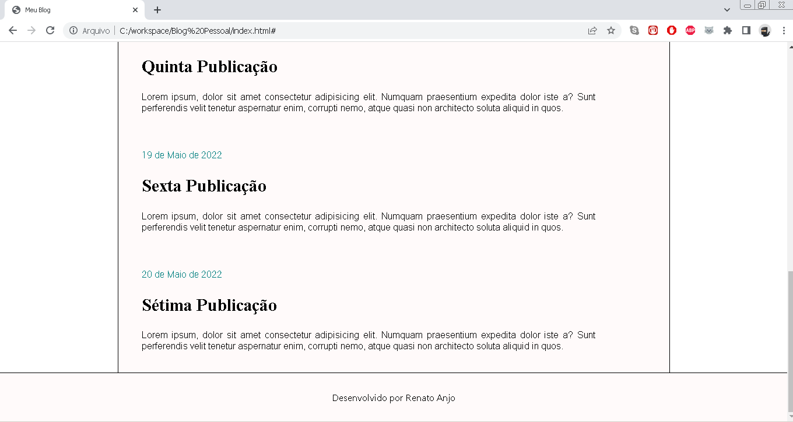

# Objetivo:
Aprimorar  habilidades utilizando as seguintes tecnologias: 
HTML e CSS 

## Webpage:  

 É uma blog para amantes de música, focado em instrumento de sopro: saxofone. 
Sobre o autor do blog, curiosidade, setup do instrumentos e muito mais. 
Contato para maiores informações e dúvidas. 
Postagens diária sobre saxofone e música em geral.

## Imagens do Projeto:

<ul>
	<li><strong>Index:</strong></li>
		<ul>		
			<li>Barra de Navegação: Home Page, Sobre, Postagens e Contato</li>
			<li>Contéudo das postagens</li>
			<li>Roda-pé</li>
		</ul>  
</ul>	

